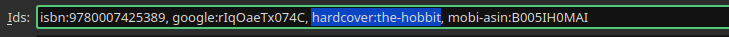

# readflow

Track your Kobo reads on Anilist and Hardcover using Calibre-Web and Calibre databases

> [!WARNING]
> This project is an early-stages WIP

## Pre-Requisites for this to actually be useful

Admittedly this is quite a niche tool. It's only really useful in the following scenario:

1. You own a Kobo eReader
2. You store all of your books in a [Calibre](https://calibre-ebook.com/) library
3. You run a [Calibre-Web](https://github.com/janeczku/calibre-web) server
4. You have configured your Kobo eReader to use the Calibre-Web
[Kobo Integration](https://github.com/janeczku/calibre-web/wiki/Kobo-Integration)
as the API endpoint

## Installation

1. Download the [GitHub Release binaries](https://github.com/RobBrazier/readflow/releases/latest)
compiled for MacOS, Linux and Windows (arm64, amd64 and i386)
2. Install with `go install`

    ```bash
    go install github.com/RobBrazier/readflow@latest
    ```

## Setup

Once installed, you'll need to configure the CLI.
This can be done by following the instructions in the below command:

```bash
readflow setup
```

This will take you through a guided form to get all the information required
for the application

## Sync

Once setup has been completed, you can run

```bash
readflow sync
```

And this will pull recent reads and sync them to the providers configured

> [!IMPORTANT]
> Currently you are required to set calibre identifiers for the providers in the
> books you want to sync. Any books missing these will be skipped.
>
> e.g. [hardcover:the-hobbit](https://hardcover.app/books/the-hobbit)
or [anilist:53390](https://anilist.co/manga/53390/Attack-on-Titan/)




## Running on a Schedule

This is a `oneshot` CLI tool, so if you want to run it frequently, you'll need
to configure a cron job

On Linux systems this can be done with

```bash
crontab -e
```

As an example, the cron job I use is:

```crontab
0 * * * * /usr/local/bin/readflow sync 2>> /var/log/readflow.log
```

This runs every hour on the hour

## Running via Docker

```bash
docker pull ghcr.io/robbrazier/readflow
```

### Environment Variables

<!-- markdownlint-capture -->
<!-- markdownlint-disable MD013 -->
| Name                | Default           | Notes                                                                                                               |
|---------------------|-------------------|---------------------------------------------------------------------------------------------------------------------|
| SOURCE              | database          | Leave as default - there are no other options currently                                                             |
| TARGETS             | anilist,hardcover | Defaults to all targets                                                                                             |
| COLUMN_CHAPTER      | false             | Only used for Anilist - set if you want to count chapters                                                           |
| DATABASE_CALIBRE    | /data/metadata.db | Mount your metadata.db here                                                                                         |
| DATABASE_CALIBREWEB | /data/app.db      | Mount your app.db here                                                                                              |
| CRON_SCHEDULE       | @hourly           | See [crontab.guru](https://crontab.guru/#@hourly) for syntax                                                        |
| TOKEN_ANILIST       |                   | Anilist token - Retrieve from [here](https://anilist.co/api/v2/oauth/authorize?client_id=21288&response_type=token) |
| TOKEN_HARDCOVER     |                   | Hardcover token - Retrieve from [here](https://hardcover.app/account/api)                                           |
<!-- markdownlint-restore -->

### Run modes

#### Cron Job

```bash
docker run -e CRON_SCHEDULE="@daily" ghcr.io/robbrazier/readflowt
```

#### One-off Sync

```bash
docker run ghcr.io/robbrazier/readflow sync
```
